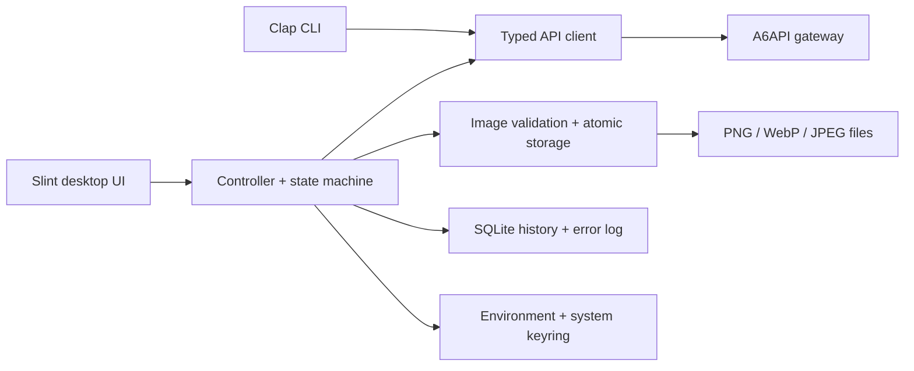

<p align="center">
  
</p>

<h1 align="center">A6 Image Studio</h1>

<p align="center">
  A polished Linux desktop and command-line client for generating images through the
  A6API OpenAI-compatible gateway.
</p>

<p align="center">
  
  
  
  
  
</p>

<p align="center">
  <a href="docs/USER_GUIDE.md">User guide</a> ·
  <a href="docs/DEVELOPMENT.md">Developer guide</a> ·
  <a href="docs/PACKAGING.md">Arch packaging</a> ·
  <a href="CHANGELOG.md">Changelog</a>
</p>

> [!WARNING]
> Image generation can incur provider charges. The desktop identifies generation
> actions, and the CLI smoke test will not run without an explicit `--yes`.

## What it does

A6 Image Studio turns an A6API key into a native Linux image-generation workflow. It combines a responsive desktop interface with permanent CLI diagnostics, secure credential storage, reliable output handling, searchable local history, and first-class Arch/CachyOS packaging.

### Generation and output

- Generate with `gpt-image-2` or another configured OpenAI-compatible image model.
- Choose common size presets or validated custom dimensions, quality, background, and PNG/WebP/JPEG output.
- Omit optional request fields individually when a compatible gateway does not support them.
- Accept Base64 or provider-hosted URL responses without forwarding the authorization header to download URLs.
- Decode and validate images off the UI thread, preserve the provider's real raster, and never silently stretch or upscale it.
- Commit output atomically without replacing an existing image or leaving partial files behind.
- Save As, copy the image or prompt, regenerate the exact request, and open the containing folder.

### Desktop experience

- Native Slint interface with Create, History, Error log, and Settings sections.
- Responsive Wayland/X11 layouts, system light/dark palette integration, keyboard shortcuts, accessibility labels, and localization hooks.
- Cancellable operations, duplicate-request prevention, stale-result rejection, bounded previews, and a six-item recent-results strip.
- Clear requested-versus-actual dimension reporting, including proportional provider adjustments and aspect-ratio warnings.

### Reliability and privacy

- Explicit connection checks with useful authentication, rate-limit, timeout, DNS, TLS, and server errors.
- Up to three attempts for temporary transport failures and HTTP 429/5xx responses, with `Retry-After` support and cancellable backoff.
- Optional Secret Service/KWallet storage; `A6API_KEY` always takes precedence.
- Transactional SQLite generation history and error records, grouped by application session.
- Sanitized diagnostic export that omits prompts, provider bodies, file paths, preferences, internal IDs, image data, and credentials.

## Stack

| Layer | Technology | Role |
| --- | --- | --- |
| Language and async runtime | Rust 2024, Tokio | Application logic, workers, cancellation, and filesystem/network concurrency |
| Desktop UI | Slint 1.17 | Declarative responsive UI, accessibility, translations, and animations |
| Windowing and rendering | Winit, Wayland/X11, FemtoVG/software renderer, Qt 6 fallback | Native Linux windows and graphics across common desktop sessions |
| HTTP and TLS | Reqwest, Rustls | OpenAI-compatible API requests and secure image downloads |
| Data formats | Serde, `image` | Typed JSON and PNG/WebP/JPEG validation/conversion |
| Persistence | Rusqlite with bundled SQLite | Sessions, history, error log, migrations, and retention |
| Credentials | `keyring`, `keyring-core`, Secret Service/KWallet | Optional encrypted desktop credential storage |
| Desktop integration | XDG Desktop Portal, `rfd`, `wl-copy`/`xclip`, `xdg-open` | File dialogs, clipboard actions, and folder opening |
| CLI and diagnostics | Clap, Tracing | Stable commands and sanitized operational logging |
| Packaging | Cargo, Arch `makepkg`, AppStream, freedesktop desktop entry/icons | Reproducible builds and Linux desktop installation |

The current dependency baseline is tested with Rust 1.94.1 on CachyOS/Arch using Qt 6.11.2, fontconfig 2.18.3, glibc 2.44, and the GCC 16.2 runtime.

## Architecture



The UI event loop never waits on network, keyring, image decoding, or filesystem work. Each operation receives an identity so cancelled or late completions cannot overwrite newer state.

## Requirements

- Linux with a Wayland or X11 desktop session.
- A current stable Rust toolchain capable of compiling Rust 2024 code.
- An A6API key with access to the configured model.
- `qt6-base` and `fontconfig` for the current desktop build.
- An active XDG Desktop Portal and desktop-specific portal backend for native file dialogs.
- Optional Secret Service/KWallet and clipboard utilities for their corresponding features.

### Arch Linux and CachyOS

Install the source-build and required runtime packages:

```bash
sudo pacman -S --needed base-devel rustup qt6-base fontconfig xdg-desktop-portal
rustup default stable
```

Install the portal backend for your desktop, such as `xdg-desktop-portal-kde` or `xdg-desktop-portal-gtk`. Optional integrations are available through:

- `gnome-keyring` or `kwallet` for stored API keys.
- `wl-clipboard` on Wayland or `xclip` on X11 for clipboard actions.
- `xdg-utils` for opening the output folder; it is already pulled in by Arch's `qt6-base` package.

## Build and run

```bash
git clone https://github.com/grandfathertech/a6-image-generator.git
cd a6-image-generator
cargo build --release --locked
./target/release/a6-image-studio
```

Running the binary without a subcommand launches the desktop interface. `gui` is the explicit equivalent:

```bash
cargo run --locked -- gui
```

No prebuilt binary is currently published. Arch/CachyOS users can build the included PKGBUILD by following the [packaging guide](docs/PACKAGING.md).

## Configuration

The desktop can save non-secret settings and optionally place the API key in the system keyring. Environment variables remain useful for development and CLI use:

| Variable | Required | Default | Purpose |
| --- | --- | --- | --- |
| `A6API_KEY` | Yes, unless stored in the desktop keyring | — | Bearer token; overrides a stored credential |
| `A6API_BASE_URL` | No | `https://api.a6api.com` | Gateway root; roots ending in `/v1` are also accepted |
| `A6API_IMAGE_MODEL` | No | `gpt-image-2` | Image model identifier |
| `RUST_LOG` | No | Application default | Sanitized diagnostic verbosity, for example `info` or `warn` |

Quick start:

```bash
export A6API_KEY='your-key-here'
cargo run --locked
```

Never commit an API key to the repository, shell history, test fixture, screenshot, issue, or diagnostic attachment.

## CLI

Check reachability, authentication, and model availability without generating a billable image:

```bash
cargo run --locked -- check
```

Run the deliberately guarded low-quality smoke generation only after confirming that a billable request is acceptable:

```bash
cargo run --locked -- smoke-generate --yes
```

List every command and option:

```bash
cargo run --locked -- --help
```

## Image dimensions and provider behavior

The custom-size editor validates each request before network access:

- Each edge must be at most 3840 pixels and divisible by 16.
- The aspect ratio may not exceed 3:1 in either direction.
- Total pixels must remain between 655,360 and 8,294,400.
- Outputs above 2560×1440 total pixels are labeled experimental.
- Transparent JPEG is rejected locally.

An OpenAI-compatible provider may return a smaller raster than requested. A6 Image Studio preserves the paid response unchanged, shows requested and decoded dimensions, identifies proportional adjustments, and warns when the aspect ratio materially changes.

## Local data and security

Application-managed files live below `~/.config/a6-studio/`:

- `settings.json` contains validated non-secret preferences.
- `a6-studio.sqlite3` contains sessions, history, and sanitized error metadata.
- `cache/` contains application cache data.

Generated images default to the user's Pictures directory and are never stored inside SQLite. Clearing history deletes metadata only, not generated files. The application can migrate former settings/history layouts and legacy keyring identities without deleting the recovery copies.

The configured gateway receives prompts and selected generation settings. Credentials are read from the environment or system keyring and are not written to settings or SQLite. See the [security policy](SECURITY.md) for reporting security issues.

## Development

The complete automated verification set is:

```bash
cargo fmt --all -- --check
cargo clippy --locked --all-targets -- -D warnings
cargo test --locked --all-targets
RUSTDOCFLAGS="-D warnings" cargo doc --locked --no-deps
cargo build --locked --release
```

Tests use local mock servers and synthetic credentials; they never contact the paid gateway. See the [developer guide](docs/DEVELOPMENT.md) for module boundaries, persistence contracts, migrations, manual desktop QA, and contribution expectations.

## Documentation

- [User guide](docs/USER_GUIDE.md) — desktop workflows, settings, keyring behavior, storage, CLI usage, and troubleshooting.
- [Developer guide](docs/DEVELOPMENT.md) — architecture, execution model, tests, migrations, and manual QA.
- [Packaging guide](docs/PACKAGING.md) — reproducible release and Arch/CachyOS package builds.
- [Contributing](CONTRIBUTING.md) — change workflow and pull-request expectations.
- [Changelog](CHANGELOG.md) — release-facing changes and known limitations.
- [Security policy](SECURITY.md) — private vulnerability reporting and credential handling.

## Project status

Version `0.1.0` is the first planned public release. Linux is the only supported desktop platform, and actual optional-parameter support can vary between OpenAI-compatible gateways.

## License

Copyright © 2026 grandfathertech. This project is proprietary and source-available for inspection; it is not open source. See [LICENSE](LICENSE) for the complete terms. Third-party dependencies retain their respective licenses.
